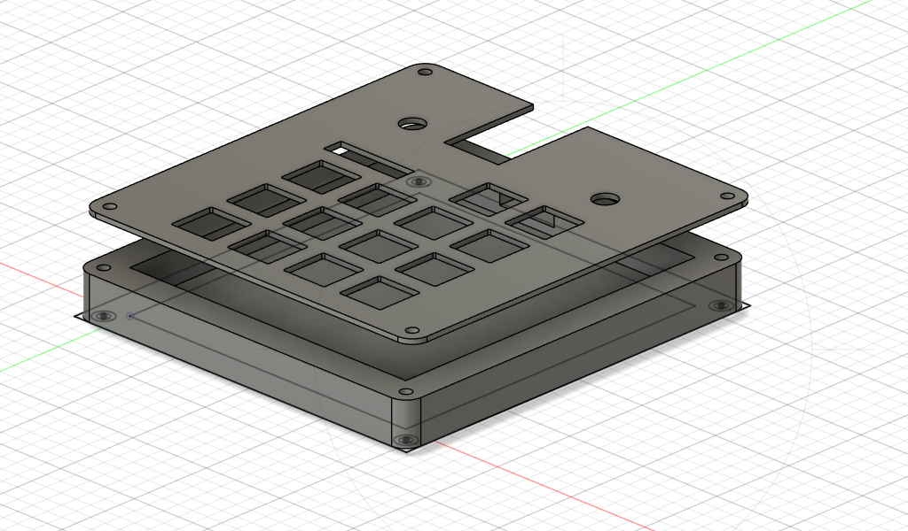
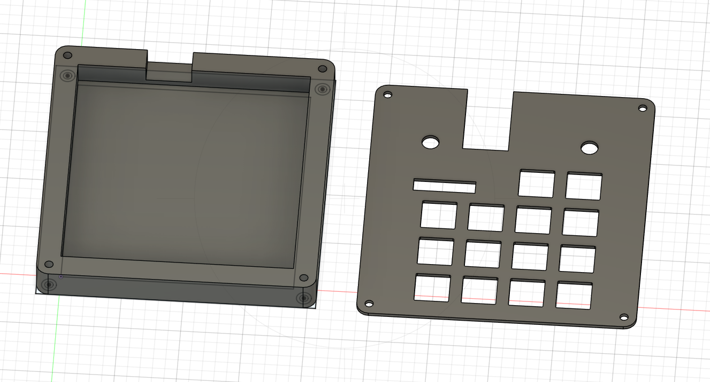
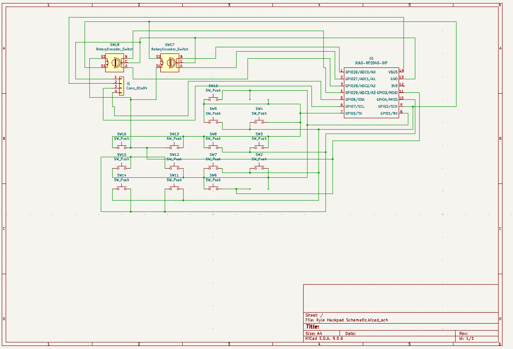
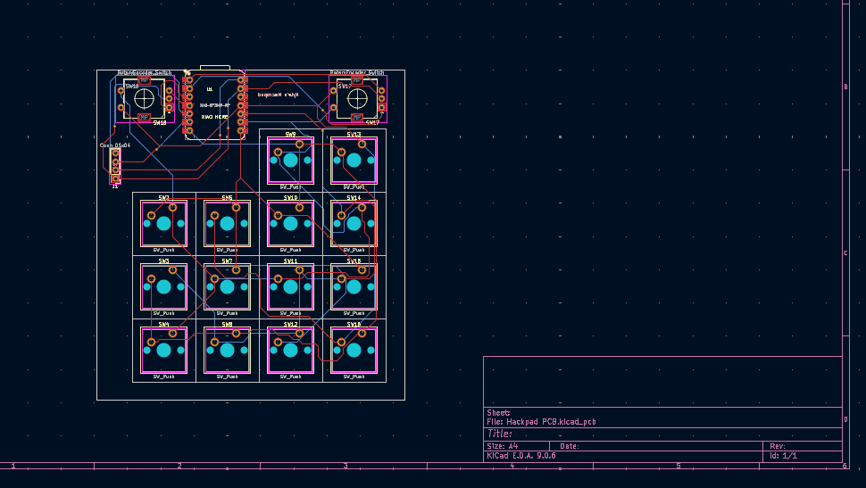

# Hackpad-macropad
A small macropad based off of Blueprint Hackclub's hackpad guide. It has 2x EC11 rotary encoders, 14x switches, and an oled screen. based off the XIAO rp2040 DIP. 

The left rotary encoder is used to cycle through 3 layers, creating 54 unique outputs from just 16 physical inputs. The firmware was very difficult on QMK, as I used charlieplexing in the wiring. The case comes in two parts, a base, which the pcb sits inside, and a top plate which sits on top and is held in by screws. 

The case assembles as so:

Schematic:

PCB:

BOM:
14x Cherry MX switches
2x EC11 rotary encoders
1x 0.91" 128x32 SSD1306 Oled display
1x XIAO RP2040
1x PCB
14x Blank DSA Keycaps
4x M3x16 Bolt
4x M3 Heatset

A massive thank you to Hackclub blueprint for this project and their guidance on the Hackpad project.